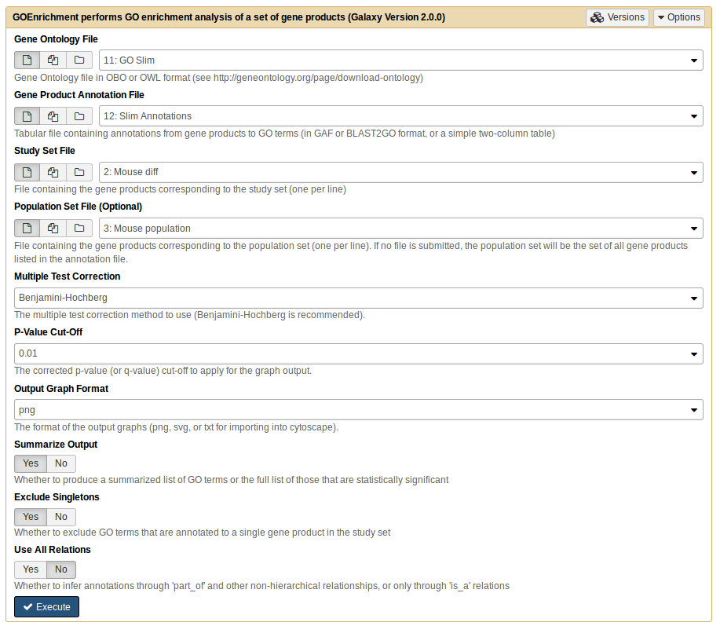

# Introduction
{:.no_toc}

When we have a large list of genes of interest (for example, a list of differentially expressed genes obtained from an RNA-Seq experiment), how do we make sense of the biological meaning of that list? One way is to perform functional enrichment analysis. This method consists of the application of statistical tests to verify if genes of interest are more often associated to certain biological functions when compared with a random set of genes. In this tutorial you will learn about enrichment analysis and how to perform it.

 
 
What is the Gene Ontology? 
The [Gene Ontology](http://www.geneontology.org/) provides structured, controlled vocabularies and classifications of many domains of molecular and cellular biology. It is divided in three separate ontologies: biological process (e.g., signal transduction), molecular function (e.g., catalytic activity) and cellular component (e.g., ribosome). These ontologies are structured as a directed acyclic graph (a hierarchy with multi-parenting) connecting GO terms which represent all the different molecular and cellular functions.
 

**Figure 1** QuickGO - http://www.ebi.ac.uk/QuickGO
 
 
What is GO annotation? 
Genes are associated to GO terms via annotations, where each gene can be associated to multiple annotations. An important notion to take into account when using GO is that, according to the **true path rule**, a gene annotated to a term is also implicitly annotated to each ancestor of that term. GO annotations have evidence codes that encode the type of evidence supporting them (eg. experimentally verified (a small minority), or inferred from in-silico experiments).    
 
> ### Agenda
>
> In this tutorial, we will deal with:
>
> 1. Functional Enrichment Analysis
> 2. Methods to simplify the results
> 3. Interpretation of the results

> {:toc}
>
{: .agenda}
> 
> 
> 
> 
> 
# Functional Enrichment Analysis

To perform a functional enrichment analysis, we need to have:
- A set of genes of interest (eg. differentially expressed genes): **study set**
- A list with all the genes to consider in the analysis: **population set**
- Gene annotations, associating genes to GO terms
- The GO ontology, with description of GO terms and their relationships
> 
For each GO term, we need to count how many (**k**) of the genes in the study set (**K**) are associated to the term, an how many (**n**) of the genes in the whole population (**N**) are associated to the same term. Then we test how likely would it be to obtain **k** genes associated to the term if **K** genes would be randomly sampled from the population. 

The appropriate statistical test is the one-tailed variant of Fisher’s exact test, also known as hypergeometric test for over-representation. When the one-tailed version is applied, this test will compute the probability of observing at least the sample frequency, given the population frequency. The [hypergeometric distribution](https://en.wikipedia.org/wiki/Hypergeometric_distribution) consists in the probability of **k** successes in **n** draws, without  replacement, from a finite population of size **N** that contains exactly **K** successful objects:  
 					[formula]
> 
> 
> 
> ###  Hands-on:
> For this first exercise we will use data from [Trapnell et al.](https://www.ncbi.nlm.nih.gov/pubmed/22383036 "Trapnell et al. data"). In this work, the authors created an artificial (in-silico) dataset of gene expression in Drosophila melanogaster, where 300 random genes were set to be differentially expressed between two conditions.
> 
> 1. **Create a new history** 
> 2. **Upload to the Galaxy** the following files:
>    - go.obo  (LINK)
>    - drosophila_gene_association.fb (LINK)
>    - Trapnell_study.txt (LINK)
>    - Trapnell_population.tab (LINK)
 
>    > ### <i class="fa fa-lightbulb-o" aria-hidden="true"></i> Tip: Upload data to Galaxy [1](https://galaxyproject.github.io/training-material/topics/introduction/tutorials/galaxy-intro-peaks2genes/tutorial.html)
>    > * **Click** on the upload button in the upper left of the interface.
>    >
>    >  
>    >
>    > * Press **Choose local file** and search for your file.
>    > * Press **Start** and wait for the upload to finish. Galaxy will automatically unpack the file.
>    {: .tip}
> 3. **Rename** the *go.obo* file to some **GO** text and *drosophila_gene_association.fb* file to some **GO annotations Drosophila melanogaster** text.
> 
>    > After you upload the files, and if you press the eye icon you should look someting like this:
> 
> **Figure 2** Trapnell file
> 
>    >Both files have the same information, the little difference between them files is the number of genes. Its important that the genes we have in the study sample must be also in the population sample. 
> 
>    > ###  Comments
>    > The study sample represents the differentially expressed genes. These were chosen as having an adjusted p-value (last column) smaller than a given threshold. This value is arbitrary, so you may choose the level of significance you want. In this case, we select the genes with an adjusted p-value < 0,05. 
>    {: .comment} 
> 
> 4. **GOEnrichment** : Run `GOEnrichment` tool with the four files.
> ..* Use the default options.
> 
> 
>    > ##  Question
>    >
>    > Question?
>    > 1. After running, what were be the results?
>    > 
>    > 

>    > 
Click to view answers

>    > This will generate 6 files with the respective default names: MF_Result.txt, BP_Result.txt, CC_Result.txt, MF_Graph, BP_Graph and CC_Graph. Where the three Result files are tables with the statistical tests for each GO Term, and the other three Graph files are graphs displaying the enrichment of the GO terms in the context of their relationships withing the ontology.
>    > 

>    {: .question}
> 
> 5. **Rename** files to MF Trapnell, BP Trapnell, CC Trapnell, MF graphTrapnell, BP graphTrapnell and CC graphTrapnell, respectively.
> 
> 
> As you can see, the output consists of a table with p values and frequencies. In addition, it also returns, based on the semantics of the GO terms, a graph, where you can view the enrichment results and highlighted enriched ontology branches. 
> 
>    > ###  Comments
>    > For each GO term we obtain a p-value corresponding to a single, independent test. Since we are making multiple similar tests, the probability of at least one of them being a false positive increases. Therefore we need to make multiple tests.
>    {: .comment} 
> 
>    > ###  Comments
>    > In general we should correct in cases we’re testing multiple functional. However, the stochastic event (sampling of genes), normally it was already been the subject of statistical testing and multiple test correction. [Ver com o Daniel Faria]
>    {: .comment} 
>  
>    >  ##  Question
>    >
>    > Question?
>    > 1. How many significant terms do we get?
>    > 
>    > 

>    > 
Click to view answers

>    >When we ask how many significant terms, we want to see GO terms that have an p-value < 0.05. According with the results, in Molecular Function we have 157 GO terms, Biological Process we have 955 GO terms and Component Cellular we have 121 GO terms.
>    > 

>    {: .question}
> 
> If you press the eye icon of the three graphs you should see something like this:
> 
> 
> 
>    > ###  Comments
>    > The ~300 genes should be random. Nonetheless we still have significant terms… [Rever este comentário com o Daniel Faria]
>    {: .comment} 
{: .hands_on}
> 
> 
> 
# Simplification of graphs
> 
Graphs views are essential, but sometimes the graph view can become overwhelming due to the size of the results. To exemplify this issue, we will next perform functional enrichment analysis using a more realistic dataset from a study using the mouse model organism. The original dataset can be found [here](https://www.ncbi.nlm.nih.gov/geo/query/acc.cgi?acc=GSE30352). In this [study](https://www.nature.com/articles/nature10532), the authors compared the gene expression of several tissues. Here, we will use results from the comparison between heart and brain.
> 
> ###  Hands-on:
> For the first exercise we will use as a study sample the differential genes (padjusted<0.05).
> 1. **Upload to the Galaxy** the mouse_brain_vs._heart.txt, Mus_musculus_annotations_biomart_e92.tab and mouse_brain_vs_heart.difgenes.txt files.
> 2. **Rename** the mouse_brain_vs._heart.txt file to **Mouse population**, Mus_musculus_annotations_biomart_e92.tab file to **GO annotations _Mus musculus_** and mouse_brain_vs_heart.difgenes.txt file to **Mouse diff**. 
> 3. **GOEnrichment** <i class="fa fa-wrench" aria-hidden="true"></i>: Run `GOEnrichment` for the new study sample.
>    - Select **'No'** in the Summarize Output option.
> 
> 4. This will generate 6 files, with the respective names: MF_Result.txt, BP_Result.txt, CC_Result.txt, MF_Graph, BP_Graph and CC_Graph. **Rename** to MF tabDiff, BP tabDiff, CC tabDiff, MF grapDiff, BP grapDiff and CC grapDiff, respectively.
> 5. Analyze the table and graph from *Biological Process*.
> 
> 
> 
>    > ###  Comments
>    > As you can see the three graphs are very complex and difficult to analyze.
>    {: .comment} 
{: .hands_on}
> 
As you may notice, the number of enriched GO Terms is very high, with graphs that are virtually uninterpretable. One way to avoid this issue is to ignore singletons and skip dependent tests. But even then the graph is still overwhelming.
> 
> 
The Summarize Output option in the GOEnrichment tool simplifies the results further, reducing the complexity while keeping branch information, although at a the cost os some specificity. [Pedir ao Daniel Faria para descrever o método um pouco mais - ver questão de artigo a publicar versus o que se põe aqui?].
> 
> 
> ###  Hands-on:
> 1. **GOEnrichment** <i class="fa fa-wrench" aria-hidden="true"></i>: Re-run `GOEnrichment` with the same files.
>    - Use the default options (notice that by default the Summarize Option is on).
> 
> 2. Analyze again the table and graph from *Biological Process*.
> 
> 
> 
>    > ##  Question
>    >
>    > Question?
>    > 1. Are there differences in complexity comparing the graph without the activation of the summarize output option and with?
>    >
>    > 

>    > 
Click to view answers

>    >Yes, there are differences. As you can see, the activation of the 'summarize' option reduces the size of the graph because, this parameter aims to remove the related terms from the list of enriched GO terms. Resulting in a more summarized graph,  that is, it presents the functions that have a higher frequency in the population. [Com o Daniel Faria, explicar um pouco mais]
>    > 

>    {: .question}
{: .hands_on}
> 
> 
Another alternative tool to reduce the results is to simplify the GO Ontology being used, using GO slims. This gives a much simpler results, but can also gives a substantial loss in specificity, comparing with the Summarize Output. Basically, the GO slims represent cut-down versions of the GO ontologies containing a subset of the terms associated to GO. This gives an ontology without the detail of the specific fine grained terms, and this is the reason for the simpler results.
> 
> 
Let’s use again the results of the mouse, but first we need to use GOSlimmer tool to convert the annotations file.
> 
> 
> ###  Hands-on:
> 1. **Upload to the Galaxy** the [goslim_generic.obo](http://www.geneontology.org/ontology/subsets/goslim_generic.obo) file.
> 2. **Rename** the *goslim_generic.obo* file to **GO Slim**.
> 3. **GOSlimmer** <i class="fa fa-wrench" aria-hidden="true"></i>: Run `GOSlimmer`.
> 
>    > ###  Comments
>    > You need to use the GO and GO annotations Mus musculus that you previously upload.
>    {: .comment}
>  
> 
> This will generate one file called **Slim Annotations**.
{: .hands_on}
> 
> 
Now we will go use the GOEnrichment tool with the new Slim Annotations file and the same study sample.
> 
>  ###  Hands-on:
> 1. **GOEnrichment** <i class="fa fa-wrench" aria-hidden="true"></i>: Run `GOEnrichment`.
>    - Use the **GOSlim**, **Slim Annotations** and **Mouse population** files.
>    - Select **'No'** in the Summarize Output option.
> 
> 
>    > ##  Question
>    >
>    > Question?
>    > 1. What is the difference when you use the GO Slim in data (instead of GO)?
>    > 2. What is the difference when you apply the GO Slim in data (instead of the Summarize option)?
>    >
>    > 
se the GOSlim, Slim Annotations and Mouse popul
>    > 
Click to view answers

>    > 1. In addition to size reduction, the GO Slim shows you an representation of biological information by using high level terms that provide a broad overview of the biology.
>    > 2. The difference between both is the ontology used. When we apply the summarize option, the GOEnrichment tool will return a summarized output (as we have seen previously), which uses the original / complete ontology. When we opted for GO Slim, the original annotation was summarized and because of this it will generate an even more summarized output, and consequently loses a lot of specification unlike the summarize option.

>    > 

>    {: .question}
{: .hands_on}
> 
> 
> 
# Interpretation of the results
The interpretation that is performed on the results will depend on the biological information that we intend to extract. Enrichment analysis can be used in validation (e.g., of a protocol for extracting membrane proteins), characterization (e.g., of the effects of a stress in a organism) and elucidation (e.g., of the functions impacted by the knock-out of a transcription factor).
> 
There is one important point to keep in mind during the analysis: statistically significant is different from biologically meaningful [Referir outra vez o caso do Trapnell?]. Its possible obtain an some biological or technical insight about the underlying experiment from statistically enriched terms, even if it isn’t readily apparent.
> 
Terms that are very generic tend to be difficult to interpret, since the very specific terms are generally not integrative. It is intended that terms that are sufficiently specific to transmit substantial biological, however, that are generic enough to integrate multiple genes.
> 
> 
And now we go use two study samples, one with overexpressed genes and the other with underexpressed genes, from the same study before.
> 
> 
> ###  Hands-on: 
> 1. **Upload to the Galaxy** the mouseOverexpressed.txt and the mouseUnderexpressed.txt files. 
>    > ##  Question
>    >
>    > Question?
>    > 1. How do you know which genes are up- and downregulated? (open the Mouse population file)

>    > 

>    > 
Click to view answers

>    > 1. It is through the logFC values that we derive the information whether the gene is up- or downregulated. If the logFC value is positive it means that the gene is upregulated, and if it is negative the gene is downregulate.
>    > 

>    {: .question}
> 
>    > ###  Comments
>    > To select the up- and downregulated genes, in addition to logFC values, its also necessary define the p-value. In this case was an p-value < 0,01.
>    {: .comment} 
> 
> 2. **GOEnrichment** <i class="fa fa-wrench" aria-hidden="true"></i>: Run `GOEnrichment` for the both files (mouseOverexpressed.txt and the mouseUnderexpressed.txt).
>    - Use the **GO**, the **GO annotations _Mus musculus_** and the **Mouse population** files.
>    - Use the default options.
> 
> 
> 
> 3. This will generate 12 files, 6 for each sample, with the respective names: MF_Result.txt, BP_Result.txt, CC_Result.txt, MF_Graph, BP_Graph and CC_Graph. **Rename** according the sample (under- and overexpressed): MF tableUnder, BP tableUnder, CC tableUnder, MF graphUnder, BP graphUnder, CC graphUnder, MF tableOver, BP tableOver, CC tableOver , MF graphOver, BP graphOver and CC graphOver.
> 
>    > ##  Question
>    > 1. When analyzing the both tables under and over, what are the related genes, heart or brain?

>    > 

>    > 
Click to view answers

>    > 1. The BP tableUnder table regards the genes that are more expressed in the brain than in the heart, therefore the terms are related to brain function. Unlike the BP tableOver table, it has the most expressed gjoanapaulas/enes that are related to the heart.
>    > 

>    {: .question}
{: .hands_on}
> 
> 
> 
# Conclusion
{:.no_toc}
Functional enrichment is a good way to look for certain patterns in populations but their analysis can become a complicated process because of its complexity. And the way to contorne the complexity, is to apply the summarize in ours sets. And thus, we will get an reduction of the complexity and consequently, an major simplicity in the results.

