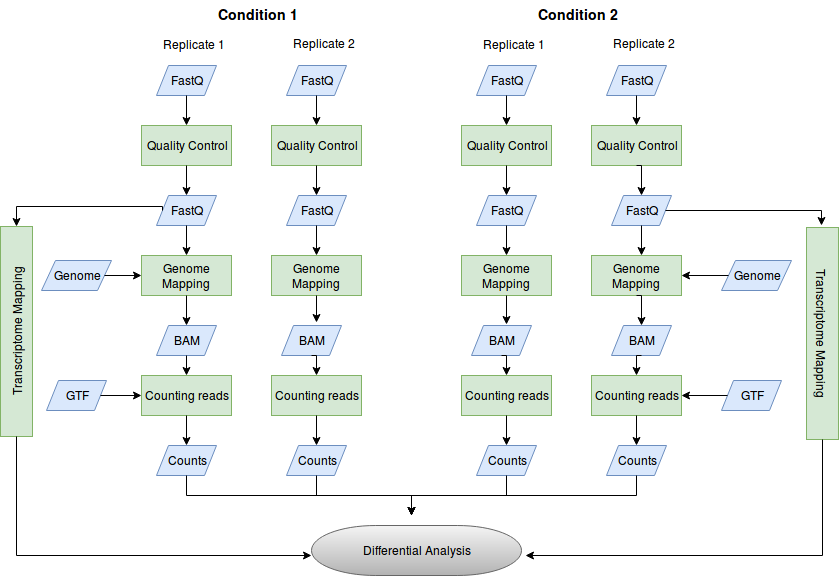

This tutorial is a shortened version of an [RNA-Seq course](https://github.com/Pfern/ADER17).

It is also very strongly inspired by another [Galaxy transcriptomics tutorial](https://galaxyproject.github.io/training-material/topics/transcriptomics/tutorials/ref-based/tutorial.html)

# Introduction

In the study of [Guilgur *et al.* 2014](https://elifesciences.org/articles/02181) the authors compared the gene expression of a *Drosophila melanogaster* mutant line (fandango) with the gene expression of its wild-type background, using RNA-Seq.

Total RNA was isolated and used for preparing mRNA-seq libraries (Illumina Truseq, selecting for polyA tails). These libraries were sequenced in an Illumina HiSeq sequencing machine to obtain a collection of mRNA sequencing reads for each sample.

> ### Agenda
>
> In this tutorial, we will deal with:
> 
> 0. [Data](#data)
> 1. [QC of sequencing reads](#qc-of-sequencing-reads)
> 2. [Estimating gene expression](#estimating-gene-expression)
> 2.1. [Generating read count table from genome mappings](#generating-read-count-table-from-genome-mappings)
> 2.1.1. [Mapping of reads to a Reference Genome](#mapping-of-reads-to-a-reference-genome)
> 2.1.2. [Visualizing alignment results](#visualizing-alignment-results)
> 2.1.3. [Counting reads per annotated gene](#counting-reads-per-annotated-gene)
> 2.2. [Mapping of reads to a Reference Transcriptome](#mapping-of-reads-to-a-reference-transcriptome)
> 3. [Differential gene expression analysis](#differential-gene-expression-analysis)
> {:toc}
>
{: .agenda}

# Data

The original raw sequencing data for this study is available at the European Nucleotide Archive (ENA) under accession [PRJEB5469](http://www.ebi.ac.uk/ena/data/view/PRJEB5469). 

There are 2 replicates for each condition (fandango and WT), 4 samples in total. 

> ### :nut_and_bolt: Comments
> - Nowadays, 3 or more replicates are more commonly used.
{: .comment}

To make this tutorial fast to execute, we selected just reads corresponding to a very limited number of example genes.

> ### :pencil2: Hands-on: Data upload
>
> + Create a **new history** for this RNA-seq exercise.
> + Import the **R1** FASTQ files (*R1.fq.gz) from [Zenodo](https://doi.org/10.5281/zenodo.849901).
>
>    > ### :bulb: Tip: Importing data via links
>    >
>    > * Copy the link location
>    > * Open the Galaxy Upload Manager
>    > * Select **Paste/Fetch Data**
>    > * Paste the link for each of the files into the text field
>    > * Press **Start** 
>    {: .tip}
> 
> 
{: .hands_on}

# QC of sequencing reads

For more details on quality control and preprocessing, you can look at the [NGS-QC tutorial](https://galaxyproject.github.io/training-material/topics/sequence-analysis/tutorials/quality-control/tutorial.html).

> ### :pencil2: Hands-on: Quality control
> + **FastQC** :wrench:: Run FastQC on mut_lib1_R1 to control the quality of the reads.
>
>    > ### :question: Questions
>    >
>    > + Is there anything that you find striking in the report?
>    >
>    >    

>    >    
Click to view answers

>    >    <ol type="1">
>    >    <li>You can see potential issues in %GC, sequence duplication and overrepresented sequences. These problems arise because this is a selected dataset. The overall quality of the sequences is good. In reality, this data has already been preprocessed, but the original quality was already quite good. It is more and more the case that raw data is ready to use right out of the machine, particularly when using single-end short reads. Nonetheless, it is always a good idea to check, in case some preprocessing is necessary.</li>
>    >    </ol>
>    >    

>    {: .question}
{: .hands_on}

# Estimating gene expression

Now that the reads are ready to use, how can we use them to estimate gene expression?

## Generating read count table from genome mappings

As the genome of *Drosophila melanogaster* is assembled, we can map the sequenced reads on this genome.

> ### :nut_and_bolt: Comment
>
> Do you want to learn more about the principles behind mapping? Follow this [tutorial](https://galaxyproject.github.io/training-material/topics/sequence-analysis/tutorials/mapping/tutorial.html).
{: .comment}

Because in the case of a eukaryotic transcriptome, most reads originate from processed mRNAs lacking exons, they cannot be simply mapped back to the genome as we normally do for DNA data. Spliced mappers have been developed to efficiently map transcript-derived reads against genomes. [TopHat](https://ccb.jhu.edu/software/tophat/index.shtml) was one of the first tools designed specifically to address this problem. Here, we will use HISAT2, a successor to TopHat2 that is faster with low memory requirements.

### Mapping of reads to a Reference Genome

We can now map all the RNA sequences on the *Drosophila melanogaster* genome using HISAT2.

> ### :pencil2: Hands-on: Spliced mapping
>
> 1. **HISAT2** :wrench:: Run **HISAT2** with:
>    - Input data format: `FASTQ`
>    - Single end or paired reads?: `Individual unpaired reads`
>    - Reads: `mut_lib1_R1 fastq` (.gz or not)
>    - Source for the reference genome: `Use a built-in genome`
>    - Select a reference genome: `D. melanogaster Aug. 2014 (BDGP Release 6 + ISO1 MT/dm6)(dm6)`
>
>    > ### :bulb: Tip: Different version
>    >
>    > * If you are using the Galaxy version 2.1.0, you don't need to define the "Input data format".
>    {: .tip}
>
>    > ### :bulb: Tip: Running with multiple samples simultaneously
>    >
>    > * In the "FASTA/Q file" choose "Multiple Datasets" and select the fastq files for all samples.
>    > * Press **Execute**.
>    {: .tip}
>
>    > ### :bulb: Tip: Compressed fastq files
>    >
>    > Fastq files can be big, and are therefore most often compressed as fastq.gz files. Many tools work directly with these files.
>    {: .tip}
>
>    > ### :nut_and_bolt: Comment
>    > Efficient aligners such as Hisat2 require an initial indexing of the reference genome. This is a computationally intensive process and galaxy instances often offer a selection of genomes already indexed. Nonetheless, one needs to be aware of the exact version of the genome that is made available in the Galaxy isntance you're using. If in doubt, download your own genome as a fasta file and use it as reference from history in the alignment step. Just note that the alignment can become much slower (particularly for large genomes) because of the initial indexing step that must be performed.
>    {: .comment}
>
> 2. Inspect the mapping statistics for mut_lib1_R1
>    - Click on "View details" (Warning icon)
>    - Click on "stderr" (Tool Standard Error)
>
>    > ### :question: Question
>    >
>    > + How many reads were mapped 1 time? 
>    > + And how many reads were mapped more than 1 time?
>    > + What is the overall alignment rate?
>    > 
>    >    

>    >    
Click to view answer

>    >    <ol type="1">
>    >    <li>180600 reads aligned exactly one time</li>
>    >    <li>17137 aligned more than one time</li>
>    >    <li>The overall alignment rate is 99.79%</li>
>    >    </ol>
>    >    

>    {: .question}
>
>    > ### :nut_and_bolt: Comment
>    > The alignment rate was so high because this was a selected dataset obtained from aligned reads. Alignment rates depend on the dataset and the organism. In bacteria and other organisms with small non-repetitive genomes have very high alignment rates, while for complex vertebrate or plant genomes this rate can go down. As a rule of thumb for higher mammals (mouse and human), alignment rates are usually over 80%.
>    {: .comment}
{: .hands_on}

### Counting reads per annotated gene

Now that we know where reads map in the genome, we need to see to which genes they correspond, and count how many reads are mapped on each gene. For this, we need genome annotations, which indicate the positions of genes in the genome. These are usually in the form of [GTF](http://www.ensembl.org/info/website/upload/gff.html) files. 

> ### :nut_and_bolt: Comment
> 
> We need to be carefull that the annotation being used was made on the same version of the genome used for alignment.
{: .comment}

[**HTSeq-count**](http://www-huber.embl.de/users/anders/HTSeq/doc/count.html) is one of the most popular tool for gene quantification.

> ### :nut_and_bolt: Comment
> 
> Feature counts is another tool to generate these counts that can be much faster than htseq-count.
{: .comment}

In principle, the counting of reads overlapping with genomic features is a fairly simple task. But there are some details that need to be decided, such how to handle multi-mapping reads. **HTSeq-count** offers 3 choices ("union", "intersection_strict" and "intersection_nonempty") to handle read mapping to multiple locations, reads overlapping introns, or reads that overlap more than one genomic feature. The recommended mode is "union", which counts overlaps even if a read only shares parts of its sequence with a genomic feature and disregards reads that overlap more than one feature.

> ### :pencil2: Hands-on: Counting the number of reads per annotated gene
>
> 1. **HTSeq-count** :wrench:: Run **HTSeq-count** on the BAM files from Hisat2 with
>    - GFF file: `Drosophila_melanogaster.BDGP6.85.sample.gtf`
>    - Mode: `Union`
>    - Stranded: `No`
>    - Minimum alignment quality: `10`
>
>    > ### :nut_and_bolt: Comment
>    > By default, htseq-count assumes the library to be stranded. If your data is not stranded, you will loose about 50% of your counts. If you don't know, it is probably best to start with unstranded.
>    {: .comment}
>
> 2. Inspect the result files
>
>    > ### :question: Question
>    >
>    > 1. Which information does the resulting files contain? 
>    > 2. Which feature has the most reads mapped on it?
>    > 
>    >    

>    >    
Click to view answers

>    >    <ol type="1">es on the Drosophila mela
>    >    <li>The result files consist of a tabular file with two columns: the gene id and the number of reads mapped on the corresponding gene</li>
>    >    <li>The gene with more reads in all samples is FBgn0000042 (Act5C, an actin gene).</li>
>    >    </ol>
>    >    

>    {: .question}
{: .hands_on}

# Differential gene expression analysis

In the end of the previous process, we have generated tables of counts, with the number of reads mapping to each of the genes (or transcripts). We will now identify which genes are impacted by the mutation based on those counts. We could compare directly the count files and estimate genes differentially expressed. Nonetheless, the number of sequenced reads mapped to a gene depends on several factors such as the sample's sequencing depth (total number of reads), the gene length, it's nucleotide composition, among other confounding factors.

> ### :nut_and_bolt: Comment
> Salmon already provides normalized values (TPM) that takes into account some of these confounding factors. Nonetheless, there is yet no consensus on whether those estimates are the most appropriate for using in differential expression analysis. **RETIRAR ???**
{: .comment}

Either for within or for inter-sample comparison, the gene counts need to be normalized. This normalization step is performed by tools specialized in differential analysis using count data, such as [**DESeq2**](https://bioconductor.org/packages/release/bioc/html/DESeq2.html) and [**edgeR**](https://bioconductor.org/packages/release/bioc/html/edgeR.html). These programs take as input tables of gene counts (**non-normalized**).

> ### :pencil2: Hands-on: Analysis of the differential gene expression (1)
>
> 1. **DESeq2** :wrench:: Run **DESeq2** with:
>    - "Genotype" as first factor with "Mutant" and "WT" as levels and selection of count files corresponding to both levels
>
>       > ### :bulb: Tip
>       >
>       > You can select several files by keeping the CTRL (or COMMAND) key pressed and clicking on the interesting files 
>       {: .tip}
>
{: .hands_on}

The first output of **DESeq2** is a tabular file. The columns are:

1.	Gene identifiers.
2.	Mean normalized counts, averaged over all samples from both conditions.
3.	Logarithm (to basis 2) of the fold change.

    The log2 fold changes are based on primary factor level 1 vs. factor level 2. The order of factor levels is then important. For example, for the factor 'Genotype', DESeq2 computes fold changes of 'Mutant' samples against 'WT' samples.

4.	Standard error estimate for the log2 fold change estimate.
5.	[Wald](https://en.wikipedia.org/wiki/Wald_test) statistic.
6.	*p*-value for the statistical significance of this change.
7.	*p*-value adjusted for multiple testing wiividual unpaired reads”th the Benjamini-Hochberg procedure which controls false discovery rate ([FDR](https://en.wikipedia.org/wiki/False_discovery_rate)).

> ### :pencil2: Hands-on: Inspection of DESeq2 results
>
>    > ### :question: Question
>    >
>    > How many genes have a significant change in gene expression between these conditions?
>    > 
>    > 

>    > 
Click to view answers

>    > One gene, FBgn0036465 (Rpn12R). The gene with splicing issues (run, FBgn0003300) does not reach statistical significance.
>    > 

>    {: .question}
>
> In addition to the list of genes, **DESeq2** outputs a graphical summary of the results, useful to evaluate the quality of the experiment:
>
> 1. Histogram of *p*-values for all tests.
> 2. [MA plot](https://en.wikipedia.org/wiki/MA_plot): global view of the relationship between the expression change of conditions (log ratios, M), the average expression strength of the genes (average mean, A), and the ability of the algorithm to detect differential gene expression. The genes that passed the significance threshold (adjusted p-value < 0.1) are colored in red.
> 3. Principal Component Analysis ([PCA](https://en.wikipedia.org/wiki/Principal_component_analysis)) with the first two axes. 
>
    Each sample is plotted as an individual data point. This type of plot is useful for visualizing the overall effect of experimental covariates and batch effects.
>
>    > ### :question: Question
>    >
>    > What is the first axis separating?
>    > 
>    > 

>    > 
Click to view answers

>    > <ol type="1"> 
>    > <li>The first axis is separating the genotype</li>
>    > </ol>
>    > 

>    {: .question}
>
> 4. Heatmap of sample-to-sample distance matrix: overview over similarities and dissimilarities between samples
>
>    > ### :question: Question
>    >
>    > How are the samples grouped?
>    > 
>    >    

>    >    
Click to view answers

>    >    <ol type="1">
>    >    <li>They are grouped by the genotype</li>
>    >    </ol>
>    >    

>    {: .question}
>
> 5. Dispersion estimates: gene-wise estimates (black), the fitted values (red), and the final maximum a posteriori estimates used in testing (blue)
{: .hands_on}

Since this is a very small dataset, most of the plots are not very meaningfull. To have a more realistic idea of such an analysis, let use a dataset that considers all genes. In their paper, Trapnell and colleagues [(Trapnell et. al, 2012)](https://www.ncbi.nlm.nih.gov/pubmed/22383036) created an artificial *Drosophila melanogaster* dataset with 2 conditions and 3 replicates each, where 300 genes were perturbed in-silico.  The original "raw" data and processed files can be found [here](https://www.ncbi.nlm.nih.gov/geo/query/acc.cgi?acc=GSE32038).

> ### :pencil2: Hands-on (optional): DESeq2 with Trapnell counts
>
> 1. **DESeq2** :wrench:: Run **DESeq2** with:
>    - "Condition" as first factor with "C1" and "C2" as levels and selection of count files corresponding to both levels
>
>    > ### :question: Question
>    >
>    > How many differentially expressed genes do you obtain (corrected p-value (FDR) < 0.05)?
>    > 
>    >    

>    >    
Click to view answers

>    >    <ol type="1">    
>    >    <li>267 with FDR<0.05.</li>
>    >    </ol>
>    >    

>    {: .question}
{: .hands_on}

[**EdgeR**](https://bioconductor.org/packages/release/bioc/html/edgeR.html) is an alternative to DESeq2. It takes a full table of counts (with headers) and a design matrix with the relevant variables and their values per sample. 

> ### :pencil2: Hands-on (optional): edgeR with Trapnell data
>
> 1. **edgeR** :wrench:: Create a Design Matrix for **edgeR** with:
>    - Expression matrix (read counts): `trapnell_counts.tab`
>    - Factor/Condition: write "Condition"
>    - C1 as the first Factor Level and select appropriate columns in the expression matrix
>    - Add C2 as another Factor level and select appropriate columns in the expression matrix
>
>    > ### :question: Question
>    >
>    > What does this step generatet?
>    > 
>    >    

>    >    
Click to view answers

>    >    <ol type="1">    
>    >    <li>It contains a table with the factors relevant for the experiment and their value for each sample.</li>
>    >    </ol>
>    >    

>    {: .question}
>
> 1. **edgeR** :wrench:: Perform Differential Gene Expression Analysis with **edgeR**:
>    - Analysis type: `Multigroup test and/or complex designs with e.g. blocking`
>    - Expression (read count) matrix: `trapnell_counts.tab`
>    - Design matrix: the generated design matrix
>    - Contrast (biological question): write "C1-C2"
>
>    > ### :question: Question
>    >
>    > How many differential genes do you obtain (FDR<0.05)?
>    > 
>    >    

>    >    
Click to view answers

>    >    <ol type="1">    
>    >    <li>277</li>
>    >    </ol>
>    >    

>    {: .question}
>
>    > ### :bulb: Tip
>    >
>    > You can select several plots as output (similar to the plots from DESeq2)
>    {: .tip}
>
{: .hands_on}

# Workflow

In this tutorial, we went briefly through the steps in the data analysis of differential expression using RNA sequencing.

> ### :pencil2: Hands-on (optional): Extract workflow from History
>
> 1. **Workflow** :wrench:: Select History -> Extract Workflow
>
>    > ### :question: Question
>    >
>    > What are the steps in the analysis of differential expression using RNA-Seq?
>    > 
>    >    

>    >    
Click to view answers

>    >    <ol type="1">    
>    >    <li>QC of sequencing reads</li>
>    >    <li>Filtering of reads (if necessary)</li>
>    >    <li>Mapping of reads to genome (if available)</li>
>    >    <li>Alternatively, mapping of reads to transcriptome (implicitly generates table of counts)</li>
>    >    <li>Generate table of read counts per gene or transcript</li>
>    >    <li>Perform differential expression test (includes data normalization)</li>
>    >    </ol>
>    >    

>    {: .question}
{: .hands_on}

> 

# Mapping of reads to a Reference Transcriptome

An alternative to mapping to the genome is to map directly against a reference transcriptome (a fasta of the transcripts). This in fact may be the only option available, particularly for non-model organisms for which only the transcriptome is available (usually generated with RNA-Seq using short illumina reads). Nonetheless, this mapping can be troublesome because of the presence of (potentially many) similar alternatively spliced transcripts for the same gene. Aligners such as Hisat2 or [BWA](http://bio-bwa.sourceforge.net/) usually ignore reads with multiple alignments, or randomly attribute them to one of the possible positions. These behaviors can often lead to improper estimates of transcript counts.

[Salmon](https://combine-lab.github.io/salmon/) provides transcript-level estimates of gene expression. It is very fast (mostly because it only aligns against the transcriptome), and uses more elaborate statistical methods to handle the presence of different alternative splice forms that difficult the attribution of a read to a transcript. Salmon can also take explicitly in consideration bias related to differences in transcript length and nucleotide composition. 

> ### :pencil2: Hands-on: Mapping of reads to a Reference Transcriptome using Salmon
>
> 1. **Salmon** :wrench:: Run **Salmon** with:
>    - Select the reference transcriptome: `Drosophila_melanogaster.BDGP6.88.sample.cdna.fa`
>    - Is this library mate-paired?: `Single-end`
>    - FASTQ/FASTA file: fastq of the different samples
>
>    > ### :bulb: Tip: Running with multiple samples simultaneously
>    >
>    > * In the "FASTQ/FASTA file" choose "Multiple Datasets" and select the fastq files for all samples.
>    > * Press **Execute**
>    {: .tip}
>
> 2. Inspect the result files.
>
>    > ### :question: Question
>    >
>    > 1. Which information does the resulting files contain? 
>    > 2. Are the read counts always integer values?
>    > 3. Are alignments generated?
>    > 
>    >    

>    >    
Click to view answers

>    >    <ol type="1">
>    >    <li>[The result files](http://salmon.readthedocs.io/en/latest/file_formats.html) consist of a tabular file with several columns: transcript id, transcript length, effective transcript length (a normalized length calculated by salmon), transcripts per million (TPM - a normalized value of read counts), and total number of reads attributed to the transcript</li>
>    >    <li>No. Each read is attributed with a certain probability to each transcript, and thus a read can be attributed to multiple transcripts with fractional values.</li>
>    >    <li>No. Just counts are generated.</li>
>    >    </ol>
>    >    

>    {: .question}
>
>    > ### :nut_and_bolt: Comment
>    > By default, salmon calculates transcript-level estimates. If one wants to have gene level estimates we can pass as parameter to salmon a tabular file with the conversion of transcripts to gene, and salmon will calculate a gene-level estimate based on the expression of all its transcripts.
>    {: .comment}
{: .hands_on}

> ### :pencil2: Hands-on (optional): DESeq2 with Salmon results
>
> 1. **DESeq2** :wrench:: Run **DESeq2** with:
>    - "Genotype" as first factor with "Mutant" and "WT" as levels and selection of count files corresponding to both levels
>
>    > ### :bulb: Tip
>    >
>    > Use transcript counts and select in DESeq2 the transcript to gene file instead of the GTF.
>    > 1. Choice of Input Data: `TPM values`
>    > 2. Program used to generate TPMs: `Salmon`
>    > 3. Gene mapping formart: `Transcript-ID and Gene-ID mapping file`
>    > 4. Tabular file with transcript - Gene mapping: `Drosophila_melanogaster.BDGP6.88.sample.cdna.tr_to_gene.tab`
>    > 5. Press **Execute**
>    {: .tip}
>
>    > ### :question: Question
>    >
>    > How do you compare the results with htseq-count?
>    > 
>    >    

>    >    
Click to view answers

>    >    <ol type="1"> 
>    >    <li>The results are not identical, but similar. On more realistic cases, results may diverge more.</li>
>    >    </ol>
>    >    

>    {: .question}
{: .hands_on}

# Visualizing alignment results

Hisat2 returns a BAM file with information about where the reads are mapped on the reference genome. 

You can visualize these alignments using software such as [IGV](http://software.broadinstitute.org/software/igv).

> ### :pencil2: Hands-on: Use IGV to visualize HISAT2 results
>
> 1. **IGV** :wrench:: Visualize the HISAT2 output BAM files of all 4 samples
>
>    > ### :question: Question
>    >
>    > 1. What can you see when looking in the region 3L:15,039,818-15,045,581 
>    > 2. What can you see when looking in the region X:20,693,493-20,698,320 
>    >
>    >    

>    >    
Click to view answers

>    >    <ol type="1">
>    >    <li>Gene Rpn12R is diferentially expressed between the 2 conditions</li>
>    >    <li>Gene run has splicing issues (less spliced in the mutant)</li>
>    >    </ol>
>    >    

>    {: .question}
>
>    > ### :bulb: Tip: Selecting the appropriate genome
>    >
>    > As a reference genome you can select dm6, but you should preferably download [BDGP6](ftp://ftp.ensembl.org/pub/release-90/fasta/drosophila_melanogaster/dna/Drosophila_melanogaster.BDGP6.dna.toplevel.fa.gz) and load genome from file.
>    {: .tip}
{: .hands_on}

> ### :nut_and_bolt: Comment
> Manual inspection of alignments using IGV is important to have a broad overview of the experiment, particularly if we have a limited set of genes of interest. Nonetheless, we cannot inspect many genes this way. There are several ways to systematically assess quality of alignments. The fraction of aligned reads is one simple measure of quality, but it is very limited. Specialized tools such as [qualimap](http://qualimap.bioinfo.cipf.es/) and [RSeqQC](http://rseqc.sourceforge.net/) can produce a wide diversity of specialized plots e.g. fraction of reads mapping to exonic regions versus intronic or intergenic, positional bias of transcript coverage (potentially indicating eg. RNA degradation), etc... 
{: .comment}
>

